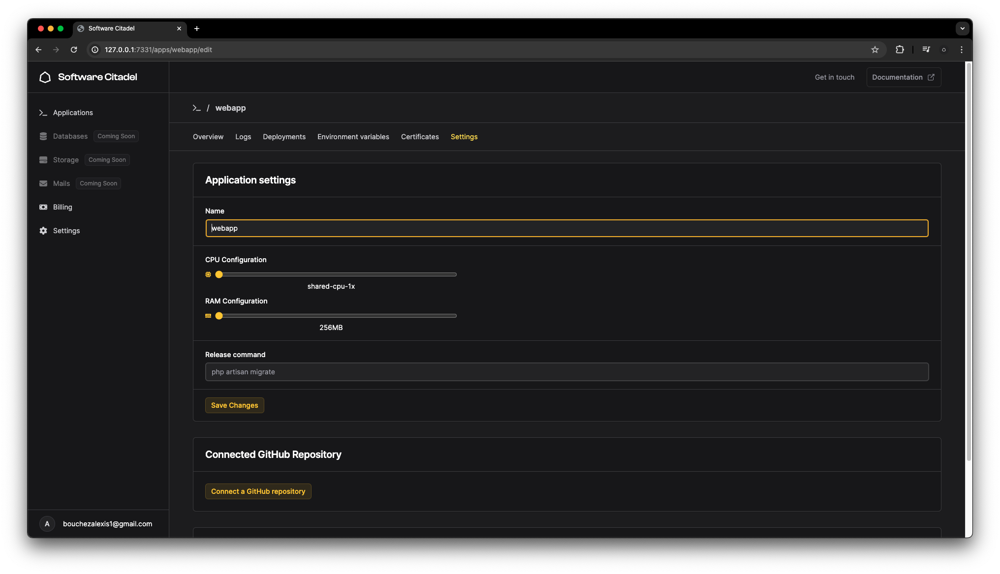

  
  

 

    <picture>
        <source srcset="./public/assets/logo_white.svg" media="(prefers-color-schema: dark)" />
        
    </picture>

<h1 align="center">
    Software Citadel
</h1>

> _Software Citadel is an open-source cloud platform that allows you to deploy and manage applications, databases, ..._

## Features

> [!WARNING]
>
> Software Citadel is in **ALPHA**, and is to be considered unstable.
>
> We are working fulltime on a stable release.

- [ ] Deploying (dockerized) and managing applications
- [ ] Creating and managing databases (PostgreSQL, MySQL, Redis)
- [ ] Storing files
- [ ] Sending transactional emails
- [ ] Tracking visits and events on your application
- [ ] Serverless functions

## License

Copyright 2024 - Valyent

Licensed under the AGPL V3 License.   See [LICENSE.md](LICENSE.md) for more information.

## Star History

Thank you for your support! 🌟

